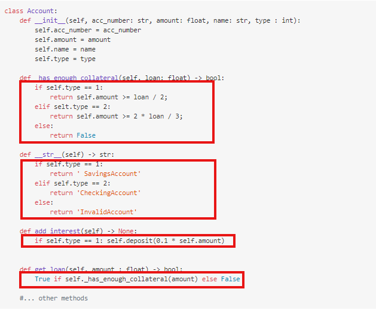
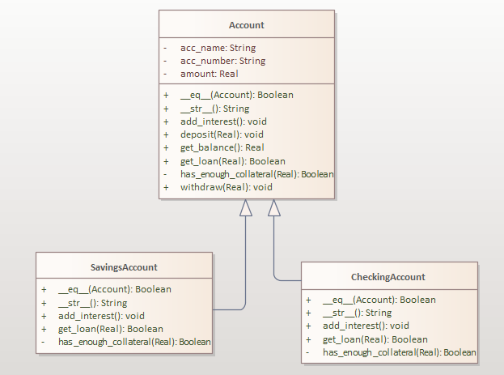
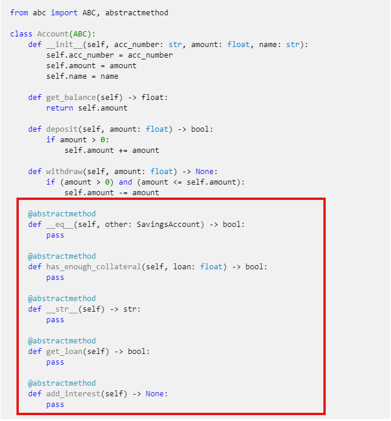
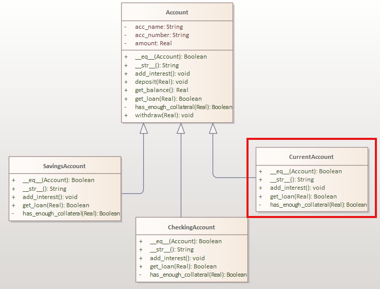
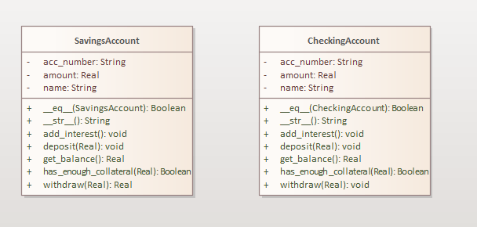
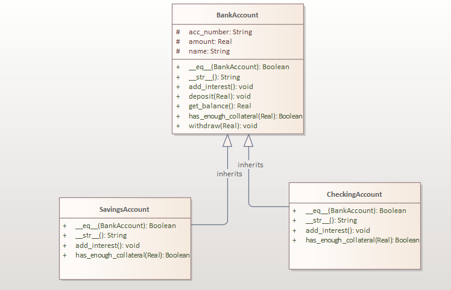

# Clean Python Code

## Table of Contents


1. [Introduction](#introduction)

2. [Naming Things](#Naming-Things)

   - [Use intention revealing name](#Use-intention-revealing-name)
   - [Meaningful Distinctions](#Meaningful-Distinctions)
   - [Avoid Disinformation](#Avoid-Disinformation)
   - [Pronounceable Names](#Pronounceable-names)
   - [Search-able Names](#Searchable-Names)
   - [Don't be cute](#Don't-be-cute)
   - [Avoid Encodings](#Avoid-Encodings)
     - [Hungarian Notation](#Hungarian-Notation)
     - [Member Prefixes](#Member-Prefixes)
     - [Interfaces & Implementations](#Interfaces-&-Implementations)
   - [Gratuitous Context](#Gratuitous-Context)
   - [Avoid Mental Mapping](#Avoid-Mental-Mapping)
   - [Class Names](#Class-Names)
     - [Types of Objects](#Types-of-Objects)
     - [Simple Superclass Name]()
     - [Qualified Subclass Name]()
   - [Method Names]()
   - [Pick One Word per Concept]()
   - [Don’t Pun]()
   - [Use Solution Domain Names]()
   - [Use Problem Domain Names]()
   - [Add Meaningful Context]()

3. [Functions](#functions)
   - [Small](#Small)
   - [Do One Thing](#Do-One-Thing)
   - [One level of Abstraction](#One-level-of-Abstraction)
   - [Avoid Conditionals](#Avoid-Conditionals)
   - [Use Descriptive Names](#Use-Descriptive-Names)
   - [Function Arguments](#Function-Arguments)
   - [Avoid Side Effects](#Avoid-Side-Effects)
     - [Pure Functions](#Pure-Functions)
     - [Niladic Functions](#Niladic-Functions)
     - [Argument Mutation](#Argument-Mutation)
     - [Exceptions](#Exceptions)
     - [I/O](#I/O)
   - [Command Query Separation](#Command-Query-Separation)
   - [Don't Repeat Yourself](#Don't-Repeat-Yourself)
4. [Objects and Data Structures](#objects-and-data-structures)
5. [Classes](#classes)
6. [SOLID Principles](#SOLID-Principles)
   - [Single Responsibility Principle](#Single-Responsibility-Principle)
   - [Open/Close Principle](#Open/Close-Principle)
   - [Liskov Substitution Principle](#Liskov-Substitution)
   - [Interface Segregation Principle](#Interface-Segregation)
   - [Dependency Inversion Principle](#Dependency-Inversion-Principle)
7. [Testing](#testing)
8. [Concurrency](#concurrency)
9. [Error Handling](#error-handling)
10. [Formatting](#formatting)
11. [Comments](#comments)
12. [Translation](#translation)

Software engineering principles, from Robert C. Martin's book
[_Clean Code_](https://www.amazon.com/Clean-Code-Handbook-Software-Craftsmanship/dp/0132350882),
adapted for Python. This is not a style guide. It's a guide to producing readable, reusable, and refactorable software in Python.

## Introduction

---

## Naming Things

---

Modern software is so complex that no one can understand all parts of a non-trivial project alone. The only way humans tame details is through abstractions. With abstraction, we focus on the essential and forget about the non-essential at that particular time. You remember the way you learned body biology?? You focused on one system at a time, digestive, nervous, cardiovascular e.t.c and ignored the rest. That is abstraction at work.

A variable name is an abstraction over memory, a function name is an abstraction over logic, a class name is an abstraction over a packet of data and the logic that operates on that data.

The most fundamental abstraction in writing software is **naming**. Naming things is just one part of the story, using good names is a skill that unfortunately, is not owned by most programmers and that is why we have come up with so many refactorings concerned with naming things.

Good names bring order to the chaotic environment of crafting software and hence, we better be good at this skill so that we can enjoy our craft.

**[⬆ back to top](#table-of-contents)**

### **Use intention revealing names**

---

This rule enforces that programmers should make their code read like well written prose by naming parts <br>
of their code perfectly. With such good naming, a programmer will never need to resort to comments or unnecessary <br> doc strings.
Below is a code snippet from a software system. Would you make sense of it without any explanation?

**Bad** :angry:

```python
from typing import List

def f(a : List[List[int]])->List[List[int]]:
    return [i for i in a if i[1] == 0]
```

It would be ashaming that someone would fail to understand such a simple function. What could have gone wrong??

The problem is simple.This code is littered with **mysterious names**. We have to agree that this is code and not a detective novel. Code should be clear and precise.

What this code does is so trivial. It takes in a collection of orders and returns the pending orders. Let's pause for a moment and appreciate the extreme over engineering in this solution.
The programmer assumes that each order is coded as a list of `ints` (`List[int]`) and that the second element is the order status. He decides that 0 means pending and 1 means cleared.

Notice the first problem... that snippet doesn't contain knowledge about the domain. This is a design smell known as a **missing abstraction**. We are missing the Order abstraction.

> **Missing Abstraction** <br>
> This smell arises when clumps of data are used instead creating a class or an interface

We have a thorny problem right now, we lack meaningful domain abstractions. One of the ways of solving the missing abstraction smell is to **map domain entities**. So lets create an abstraction called Order.

```python
from typing import List

class Order:
    def __init__(self, order_id : int, order_status : int) -> None:
        self._order_id = order_id
        self._order_status = order_status

    def is_pending(self) -> bool:
            return self._order_status == 0:

    #more code goes here
```

> We could also have used the **namedtuple** in the python standard library but we won't be too functional that early. Let us stick with OOP for now. **namedtuples** contain only data and not data with code that acts on it.

Let us now refactor our entity names and use our newly created abstraction too. We arrive at the following code snippet.

**Better: :smiley:**

```python
from typing import List

Orders = List[Order]

def get_pending_orders(orders : Orders)-> Orders:
    return [order for order in orders if order.is_pending()]
```

This function reads like well written prose.

Notice that the `get_pending_orders()` function delegates the logic of finding the order status to the Order class. This is because the Order class knows its internal representation more than anyone else, so it better implement this logic. This is known as the **Most Qualified Rule** in OOP.

> **Most Qualified Rule** <br>
> Work should be assigned to the class that knows best how to do it.

> We are using the listcomp for a reason. Listcomps are examples of **iterative expressions**. They serve one role and that is creating lists. On the other hand, for-loops are **iterative commands** and thus accomplish a myriad of tasks. Pick the right tool for the job.

Never allow client code know your implementation details. In fact the ACM A.M Laureate Babra Liskov says it soundly in her book [Program development in Java. Abstraction, Specification and OOD](https://book4you.org/book/1164544/93467d). The **Iterator design pattern** is one way of solving that problem.

Here is another example of a misleading variable name.

**Bad** :angry:

```python
student_list= {'kasozi','vincent', 'bob'}
```

This variable name is so misleading.

- It contains noise. why the list suffix?
- It is lying to us. Lists are not the same as sets. They may all be collections but they are not the same at all.

To prove that lists are not sets, below is a code snippet that returns the methods in the List class that aren't in the Set class.

```python
sorted(set(dir(list())) - set(dir(set())))
```

Once it has executed, `append()` is one of the returned functions implying that sets don't support `append()` but instead support `add()`. So you write the code below, your code breaks.

> Sets are not sequences like lists. In fact, they are unordered collections and so adding the `append()` method to the set class would be misleading. `append()` means we are adding at the end which may not be the case with sets.

**Bad** :angry:

```python
student_list= {'kasozi','vincent', 'bob'}
student_list.append('martin') #It breaks!!
```

It is better to use a different variable name is neutral to the data structure being used.
In this case, once you decide to change data structure used, your variable won't destroy the semantics of your code.

**Good** :smiley:

```python
students = {'kasozi', 'vincent', 'bob'}
```

> You can not achieve good naming with a bad design. You can see that mapping domain entities into our code has made our codebase use natural names.

**[⬆ back to top](#table-of-contents)**

## Meaningful-Distinctions

**[⬆ back to top](#table-of-contents)**

## Avoid-Disinformation

**[⬆ back to top](#table-of-contents)**

## Pronounceable-names

---

When naming things in your code, it is much better to use names that are easy to pronounce by programmers. This enables developers discuss the code without the need to sound silly as they mention the names. If you a polyglot in natural langauges, it is much better to use the language common to most developers when naming your entities.

**Bad** :angry:

```python
from typing import List
import math

def sqrs(first_n : int)-> List[int]:
    if first_n > 0:
        return [int(math.pow(i, 2)) for i in xrange(first_n)]
    return []

lstsqrs = sqrs(5)
```

How can a human pronounce sqrs and lstsqrs? This is a serious problem. Let's correct it.

**Good** :smiley:

```python
from typing import List
import math

def generate_squares(first_n : int)-> List[int]:
    if first_n > 0:
        return [int(math.pow(i, 2)) for i in xrange(first_n)]
    return []

squares = generate_squares(5)
```

**[⬆ back to top](#table-of-contents)**

### Searchable-Names

**[⬆ back to top](#table-of-contents)**

### Don't-be-cute

**[⬆ back to top](#table-of-contents)**

### Avoid-Encodings

**[⬆ back to top](#table-of-contents)**

#### Hungarian-Notation

#### Member-Prefixes

#### Interfaces-&-Implementations

### Gratuitous-Context

**[⬆ back to top](#table-of-contents)**

### Avoid-Mental-Mapping

**[⬆ back to top](#table-of-contents)**

## **Functions**

### **Small**

**[⬆ back to top](#table-of-contents)**

### Do-One-Thing

**[⬆ back to top](#table-of-contents)**

### One-level-of-Abstraction

**[⬆ back to top](#table-of-contents)**

### Avoid Conditionals

---

Let us meet Joe. Joe is a junior web developer who works at a certain company in Nairobi. Joe's company has got a new client who wants Joe's company to build him an application to manage his bank.

The client specifies that this application will manage user bank accounts. Joe organizes a meeting with the client and they agree to meet so that Joe can collect the client's business needs. Let us watch Joe as he puts his OOP programming skills to work.

After their meeting, they agree that the user account will be able to accomplish the behaviour specified in the figure below.


The code below provides the implementation details of this class.

```python
class Account:
    def __init__(self, acc_number: str, amount: float, name: str):
        self.acc_number = acc_number
        self.amount = amount
        self.name = name

    def get_balance(self) -> float:
        return self.amount

    def __eq__(self, other: Account) -> bool:
        if isinstance(other, Account):
            return self.acc_number == other.acc_number

    def deposit(self, amount: float) -> bool:
        if amount > 0:
            self.amount += amount

    def withdraw(self, amount: float) -> None:
        if (amount > 0) and (amount <= self.amount):
            self.amount -= amount

    def _has_enough_collateral(self, loan: float) -> bool:
        if loan < self.amount / 2:
            return True

    def __str__(self) -> str:
        return f'Account acc number : {self.acc_number} amount : {self.amount}'

    def add_interest(self) -> None:
        self.deposit(0.1 * self.amount)

    def get_loan(self, amount : float) -> bool:
        if self._has_enough_collateral(amount):
            return True
        else:
            return False
```

The application is a success and after a month, the client comes back to Joe asking for more features. The client says that he now wants the application to work with more than one type of account. The application should now process SavingsAccount and CheckingAccount accounts. The difference between them is outlined below.

- When authorizing a loan, a checking account needs a
  balance of two thirds the loan amount, whereas savings accounts require only one half the loan amount.

- The bank gives periodic interest to savings accounts but not checking accounts.

- The representation of an account will return
  “Savings Account” or “Checking Account,” as appropriate.

Joe rolls up his sleeves and starts to make modifications to the original Account class to introduce the new features. Below is his approach.

**Bad** :angry:

```python
class Account:
    def __init__(self, acc_number: str, amount: float, name: str, type : int):
        self.acc_number = acc_number
        self.amount = amount
        self.name = name
        self.type = type

    def _has_enough_collateral(self, loan: float) -> bool:
        if self.type == 1:
            return self.amount >= loan / 2;
        elif selt.type == 2:
            return self.amount >= 2 * loan / 3;
        else:
            return False

    def __str__(self) -> str:
        if self.type == 1:
            return ' SavingsAccount'
        elif self.type == 2:
            return 'CheckingAccount'
        else:
            return 'InvalidAccount'

    def add_interest(self) -> None:
        if self.type == 1: self.deposit(0.1 * self.amount)


    def get_loan(self, amount : float) -> bool:
        True if self._has_enough_collateral(amount) else False

    #... other methods
```

> **Note:** We have only shown the methods that changed.

With this implementation, Joe is happy and he ships the app into production since it works as the client had wanted. But something has really gone wrong here.



The problem are these conditionals here. They work for now but they will cause a maintenance nightmare very soon. What will happen if the client comes back asking Joe to add more account types? Joe will have to open this class and add more IFs. What happens of the client asks him to delete some of the account types? He will open the same class and edit all Ifs again.

This class is now violating the **Single Responsibility Principle** and the **Open Closed Principle**. The class has more than one reason to change and still, it is not closed for modification and
these IFs may also run slow.

This smell is called the **Missing Hierarchy** smell.

> **Missing Hierarchy** <br/>
> This smell arises when a code segment uses conditional logic (typically in conjunction
> with “tagged types”) to explicitly manage variation in behavior where a hierarchy
> could have been created and used to encapsulate those variations.

To solve this problem, we will need to introduce an hierarchy of account types.
We will achieve this by creating a super abstract class Account and implement all the common methods but mark the account specific methods abstract.
Different account types can then inherit from this base class.



With this new approach, account specific methods will be implemented by subclasses and note that we will throw away those annoying IFs and replace them with polymorphism hence the **Replace Conditionals with Polymorphism** rule.

Below are the implementation of Account, SavingsAccount and CheckingAccount.



**SavingsAccount class**

**Good** :smiley:

```python
class SavingAccount(Account):
    def __init__(self, acc_number: str, amount: float, name: str):
        Account.__init__(self, acc_number, amount, name)

    def __eq__(self, other: SavingsAccount) -> bool:
         if isinstance(other, SavingsAccount):
            return self.acc_number == other.acc_number


    def _has_enough_collateral(self, loan: float) -> bool:
        return self.amount >= loan / 2;

    def get_loan(self, amount : float) -> bool:
        return _has_enough_collateral(float)

    def __str__(self) -> str:
        return f'Saving Account acc number : {self.acc_number}'

    def add_interest(self) -> None:
        self.deposit(0.1 * self.amount)
```

**CheckingAccount class**

**Good** :smiley:

```python
class CheckingAccount(Account):
    def __init__(self, acc_number: str, amount: float, name: str):
        Account.__init__(self, acc_number, amount, name)

    def __eq__(self, other: SavingsAccount) -> bool:
         if isinstance(other, CheckingAccount):
            return self.acc_number == other.acc_number


    def has_enough_collateral(self, loan: float) -> bool:
        return self.amount >= 2 * loan / 3;

    def get_loan(self, amount : float) -> bool:
        return _has_enough_collateral(float)

    def __str__(self) -> str:
        return f'Checking Account acc number : {self.acc_number}'

    #empty method.
    def add_interest(self) -> None:
        pass
```

Notice that each branch of the original annoying `if else` is now implemented in its class. Now if the client comes back and asks Joe to add a fixed deposit account, Joe will just create a new class called FixedDeposit and it will inherit from that abstract Account class. With this design, note that :

- To add new functionality, we add more classes and ignore all existing classes. This is the **Open Closed Principle.**

Note that the CheckingAccount class leaves the add_interest method empty. This is a code smell known as the **Rebellious Hierarchy** design smell and we shall fix it later when we get to the **Interface Segregation Principle**.

> **REBELLIOUS HIERARCHY** <br>
> This smell arises when a subtype rejects the methods provided by its supertype(s).
> In this smell, a supertype and its subtypes conceptually share an IS-A relationship,
> but some methods defined in subtypes violate this relationship. For example, for
> a method defined by a supertype, its overridden method in the subtype could:
>
> - throw an exception rejecting any calls to the method
> - provide an empty (or NOP i.e., NO Operation) method
> - provide a method definition that just prints “should not implement” message
> - return an error value to the caller indicating that the method is unsupported.

After a year, Joe's client comes back and asks Joe to add a Current account. Guess what Joe does?? You guessed right, he just creates a new class for this new account and inherits from Account class as shown in the figure below.


**[⬆ back to top](#table-of-contents)**

### Use-Descriptive-Names

**[⬆ back to top](#table-of-contents)**

### Function-Arguments

**[⬆ back to top](#table-of-contents)**

### Avoid-Side-Effects

#### **Pure Functions**

---

What on earth is a pure function?? Well, adequately put, a pure function is one without side effects.
Side effects are invisible inputs and outputs from functions. In pure Functional programming,functions behave like mathematical functions. Mathematical functions are transparent-- they will always return the same output when given the same input. Their output only depends on their inputs.

Below are examples of functions with side effects:

#### 1. **Niladic-Functions**

---

**Bad** :angry:

```python
class Customer:
    def __init__(self, first_name : str)-> None:
        self.first_name = first_name

    #This method is impure, it depends on global state.
    def get_name(self):
        return self.first_name

    #more code here
```

Niladic functions have this tendency to depend on some invisible input especially if such a function is member function of a class. Since all class members share the same class variables, most methods aren't pure at all. Class variable values will always depend on which method was called last. In a nutshell, most niladic functions depend on some **global state** in this case `self.first_name`.

The same can be said to functions that return None. These too aren't pure functions. If a function doesn't return, then it is doing something that is affecting global state. **Such functions can not be composed in fluent APIs.** The sort method of the list class has side effects, it changes the list in place whereas the sorted builtin function has not side effects because it returns a new list.

> `sort()` and `reverse()` are now discouraged and instead using the built-in `reversed()` and `sorted()` are encouraged.

**Bad** :angry:

```python
names = ['Kasozi', 'Martin', 'Newton', 'Grady']

#wrong: sorted_names now contains None
sorted_names = names.sort()

#correct: sorted_names now contain the sorted list
sorted_names = sorted(names)
```

> **static methods** <br>
> One way to solve this problem is to use static methods inside a class. Static methods know nothing about the class data and hence their outputs only depend on their inputs.

#### 2. **Argument Mutation**

---

Functions that mutate their input arguments aren't pure functions. This becomes more pronounced when we run on multiple cores. More than one function may be reading from the same variable and each function can be context switched from the CPU at any time. If it was not yet done with editing the variable, others will read garbage.

**Bad** :angry:

```python
from typing import List

Marks = List[int]

marks = [43, 78, 56, 90, 23]

def sort_marks(marks : Marks) -> None:
    marks.sort()

def calculate_average(marks : Marks) -> float:
    return sum(marks)/float(len(marks))
```

From the above code snippet, we have two functions that both read the same list. `sort_marks()` mutates its input argument and this is not good. Now imagine a scenario when `calculate_average_mark()` was running and before it completed, it was context switched and `sort_marks()` allowed to run.

sort_marks will update the list in place and change the order of elements in the list, by the time `calculate_average_average()` will run again, it will be reading garbage.

**Good :smiley:**

```python
from typing import List

Marks = List[int]

marks = [43, 78, 56, 90, 23]

#sort_marks now returns a new list and uses the sorted function

#Mutates input argument
def sort_marks(marks : Marks) -> Marks:
    return sorted(marks)

# Doesn't mutate input argument
def find_average_mark(marks : Marks) -> float:
    return sum(marks)/len(marks)
```

This problem can also be solved by using immutable data structures.

> Function purity is also vital for unit-testing. Impure functions are hard to test especially if the side effect has to do with I/O. Unlike mutation, you can’t avoid side effects related to I/O; whereas mutation is an implementation detail, I/O is usually a requirement.

#### 3. **Exceptions**

---

Some function signatures are more expressive than others, by which I mean that they give us
more information about what the function is doing, what inputs are permissible, and what outputs we can expect. The signature `() → ()`, for example, gives us no information at all: it may print some text, increment a counter, launch a spaceship... who knows! On the other hand, consider this signature:

`(List[int], (int → bool)) → List[int]`

Take a minute and see if you can guess what a function with this signature does. Of course, you
can’t really know for sure without seeing the actual implementation, but you can make an
educated guess. The function returns a list of `ints` as input; it also takes a list of `ints`, as well as a
second argument, which is a function from int to `bool`: a predicate on int.

But is not honest enough. What happens if we pass in an empty list?? This function may throw an exception.

> Exceptions are hidden outputs from functions and functions that use exceptions have side effects.

**Bad** :angry:

```python
def find_quotient(first : int, second : int)-> float:
    try:
        return first/second
    except ZeroDivisionError:
        return None
```

What is wrong with such a function? In its signature, it claims to return a float but we can see that sometimes it fails. Such a function is not honest and such functions should be avoided.

> Functiona languages handle errors using other means like Monads and Options. Not with exceptions.

#### 4. **I/O**

---

Functions that perform input/output aren't pure too. Why? This is because they return different outputs when given the same input argument. Let me explain more about this. Imagine a function that takes in an URL and returns HTML, if the HTML is changed, the function will return a different output but it is still taking in the same URL. Remember mathematical functions don't behave like this.

**Bad** :angry:

```python
def read_HTML(url : str)-> str:
    try:
        with open(url) as file:
            data = file.read()
        data = file.read()
        return data
    except FileNotFoundError:
        print('File Not found')
```

This function is plagued with more than one problem.

- Its signature is not honest. It claims that the function returns a string and takes in a string but from the implementation, we see it can fail.
- This function is performing IO. IO operations produce side effects and thus this function is not pure.

> You can build pure functions in python with the help of the **operator** and **functools** modules. There is a package **fn.py** to support functional programming in Python 2 and 3. According
> to its author, Alexey Kachayev, fn.py provides “implementation of missing features to
> enjoy FP” in Python. It includes a @recur.tco decorator that implements tail-call optimization
> for unlimited recursion in Python, among many other functions, data structures,
> and recipes.

### Command-Query-Separation

---

### Don't Repeat Yourself (DRY)

---

Let us imagine that we are working on a banking application. We all know that such an application will manipulate bank account objects among other things.
Let us assume that at the start of the project, we have only two types of accounts to work with;

- Savings Account
- Checking Account

We roll up our sleeves and put our OOP knowledge to test. We craft two classes to model both and Savings and Checking accounts.

**SavingsAccount class**

**Bad** :angry:

```python
class SavingsAccount:
    def __init__(self, acc_number: str, amount: float, name: str):
        self.acc_number = acc_number
        self.amount = amount
        self.name = name

    def get_balance(self) -> float:
        return self.amount

    def __eq__(self, other: SavingsAccount) -> bool:
        if isinstance(other, SavingsAccount):
            return self.acc_number == other.acc_number

    def deposit(self, amount: float) -> bool:
        if amount > 0:
            self.amount += amount

    def withdraw(self, amount: float) -> None:
        if (amount > 0) and (amount <= self.amount):
            self.amount -= amount

    def has_enough_collateral(self, loan: float) -> bool:
        if loan < self.amount / 2:
            return True

    def __str__(self) -> str:
        return f'Saving Account acc number : {self.acc_number}'

    def add_interest(self) -> None:
        self.deposit(0.1 * self.amount)
```

**CheckingAccount class**

**Bad** :angry:

```python
class CheckingAccount:
    def __init__(self, acc_number: str, amount: float, name: str):
        self.acc_number = acc_number
        self.amount = amount
        self.name = name

    def get_balance(self) -> float:
        return self.amount

    def __eq__(self, other: SavingsAccount) -> bool:
        if isinstance(other, SavingsAccount):
            return self.acc_number == other.acc_number

    def deposit(self, amount: float) -> bool:
        if amount > 0:
            self.amount += amount

    def withdraw(self, amount: float) -> None:
        if (amount > 0) and (amount <= self.amount):
            self.amount -= amount

    def has_enough_collateral(self, loan: float) -> bool:
        if loan < self.amount / 5:
            return True

    def __str__(self) -> str:
        return f'Checking Account acc number : {self.acc_number}'

    def add_interest(self) -> None:
        self.deposit(0.5 * self.amount)
```

The table describes all the methods added to both classes.

| method                    | description                                         |
| ------------------------- | --------------------------------------------------- |
| `get_balance()`           | returns the account balance                         |
| `__str__()`               | returns the string representation of account object |
| `add_interest()`          | adds a given interest to a given account            |
| `has_enough_collateral()` | checks if the account can be granted a loan         |
| `withdraw()`              | withdraws a given amount from the account           |
| `deposit()`               | deposits an amount to the account                   |
| `__eq__()`                | checks if 2 accounts are the same                   |

The Unified Modeling Language (UML) class diagrams of both classes are shown below. Notice the dulication in method names.



If you look more closely, both these classes contain the same methods and to make it worse, most of these methods contain exactly the same code. This is a **bad** practice and it leads to a maintenance nightmare. Identical code is littered in more than one place and so if we ever make changes to one of the copies, we have to change all the others.

There is a software principle that helps in solving such a problem and this principle is known as **DRY** for Don't Repeat Yourself.

> The “Don’t Repeat Yourself” Rule <br>
> A piece of code should exist in exactly one place.

It is evident from our bad design that we have two classes that both claim to do same thing really well and so we just violated the **Most Qualified Rule**. In most cases, such scenarios arise due to failing to identify similarities between objects in a system.

To solve this problem, we will use inheritance. We will define a new abstract class called BankAccount and we will implement all the method containing the similar logic in this abstract class. Then we will leave the different methods to be implemented by subclasses of BankAccount.

Below is the UML diagram for our new design.



**BankAccount** class

**Good** :smiley:

```python
from abc import ABC, abstractmethod

class BankAccount(ABC):
    def __init__(self, acc_number: str, amount: float, name: str):
        self.acc_number = acc_number
        self.amount = amount
        self.name = name

    def get_balance(self) -> float:
        return self.amount

    def deposit(self, amount: float) -> bool:
        if amount > 0:
            self.amount += amount

    def withdraw(self, amount: float) -> None:
        if (amount > 0) and (amount <= self.amount):
            self.amount -= amount

    @abstractmethod
    def __eq__(self, other: SavingsAccount) -> bool:
        pass

    @abstractmethod
    def has_enough_collateral(self, loan: float) -> bool:
        pass

    @abstractmethod
    def __str__(self) -> str:
        pass

    @abstractmethod
    def add_interest(self) -> None:
        pass
```

> **Note :** In the BankAccount abstract class, the methods `__eq__()`, `has_enough_collateral()`, `__str__()` and `add_interest()` are abstract and so it is the responsible of subclasses to implement them.

**SavingsAccount class**

**Good** :smiley:

```python
class SavingAccount(BankAccount):
    def __init__(self, acc_number: str, amount: float, name: str):
        BankAccount.__init__(self, acc_number, amount, name)

    def __eq__(self, other: SavingsAccount) -> bool:
         if isinstance(other, SavingsAccount):
            return self.acc_number == other.acc_number


    def has_enough_collateral(self, loan: float) -> bool:
        if loan < self.amount / 2:
            return True


    def __str__(self) -> str:
        return f'Saving Account acc number : {self.acc_number}'


    def add_interest(self) -> None:
        self.deposit(0.1 * self.amount)
```

**SavingsAccount class**

**Good** :smiley:

```python
class CheckingAccount(BankAccount):
    def __init__(self, acc_number: str, amount: float, name: str):
        BankAccount.__init__(self, acc_number, amount, name)

    def __eq__(self, other: SavingsAccount) -> bool:
         if isinstance(other, CheckingAccount):
            return self.acc_number == other.acc_number


    def has_enough_collateral(self, loan: float) -> bool:
        if loan < self.amount / 5:
            return True


    def __str__(self) -> str:
        return f'Checking Account acc number : {self.acc_number}'


    def add_interest(self) -> None:
        self.deposit(0.5 * self.amount)
```

With this new design, if we ever want to modify the methods common to both classes, we only edit them in the abstract class. This simplifies our codebase maintenance. In fact, this was of organizing code is so ideal for implementing the **Replace Ifs with Polymorphism (RIP)** principle as we shall see later.

## **SOLID Principles**

### 1. Single Responsibility Principle

---

The single responsibility principle (SRP) instructs developers to write code that has one and only one
reason to change. If a class has more than one reason to change, it has more than one responsibility.
Classes with more than a single responsibility should be broken down into smaller classes, each of
which should have only one responsibility and reason to change.

This section explains that process and shows you how to create classes that only have a single
responsibility but are still useful. Through a process of delegation and abstraction, a class that contains
too many reasons to change should delegate one or more responsibilities to other classes.

It is difficult to overstate the importance of delegating to abstractions. It is the lynchpin of adaptive
code and, without it, developers would struggle to adapt to changing requirements in the way
that Scrum and other Agile processes demand.
